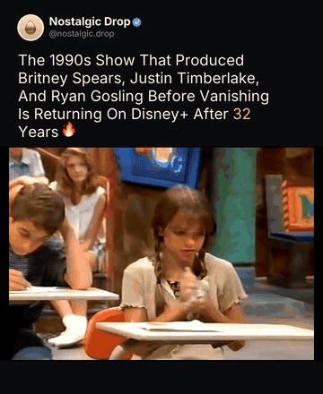
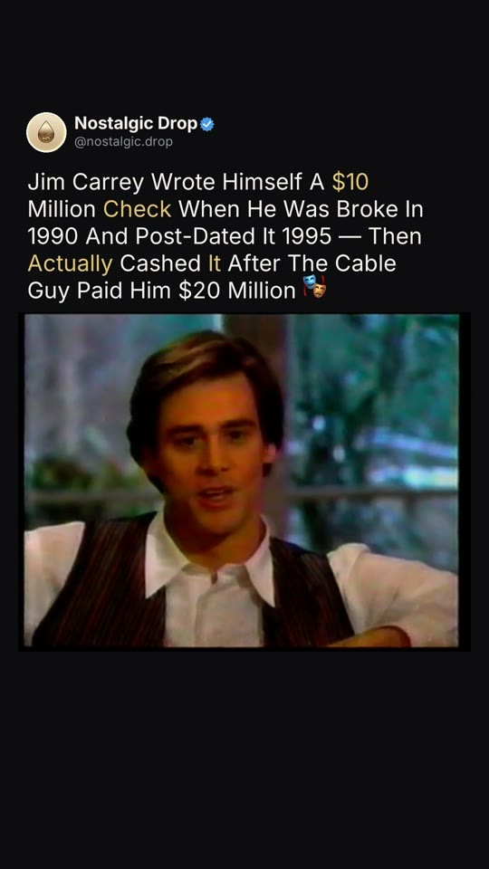
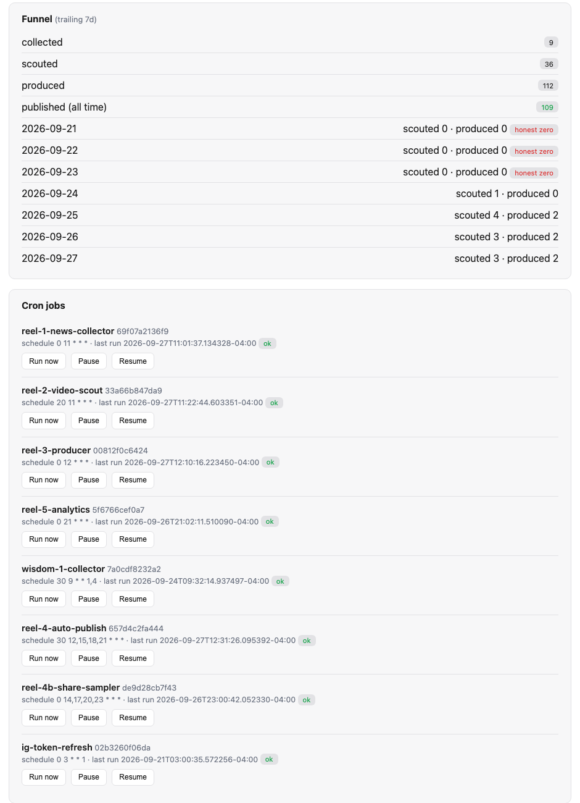
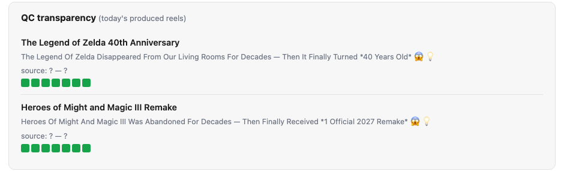

# Media Pipeline

[](https://github.com/eddylam2024/media-pipeline/actions/workflows/ci.yml)
[](LICENSE)
[](https://github.com/NousResearch/hermes-agent)

**An autonomous, agent-operated short-form video pipeline: from news signal to published Instagram Reel, with a closed performance feedback loop.**

Built on [Hermes Agent](https://github.com/NousResearch/hermes-agent) by
[Nous Research](https://nousresearch.com).

<p align="center">
  
</p>

<p align="center"><sub>A reel the pipeline produced and published end to end for @nostalgic.drop:
1,964 accounts reached, 2,575 views.</sub></p>

---

## The problem

Short-form content is a volume and timing game. An account has to be relevant
to today's news, publish every day, and learn from its own numbers faster than
a person can. For a small operator, doing this by hand means hours a day of
monitoring news, digging through footage, editing, writing copy, posting, and
checking analytics, and those steps are exactly where the quality slips.

## The approach

Media Pipeline splits the work along one line:

- **Deterministic work is done by code.** Fetching news, searching video,
  cutting clips, rendering, checking frames for watermarks, publishing, and
  pulling metrics are plain Python scripts that do the same thing every time
  and can be audited.
- **Judgment is done by agents.** Deciding which story is worth telling, which
  moment of footage is strongest, how to write the hook, and whether a frame
  shows the right subject are handled by Hermes agents running on a schedule.
  They follow a written operating playbook (the skill) and are only allowed to
  *call* the scripts, never reimplement them.

Two controls keep this safe to leave unattended:

- **A hard QC gate.** No reel is finalized until the agent has left per-frame
  evidence that it inspected the footage, *and* an independent pixel-level
  check finds no readable burned-in watermark or caption, whatever the agent
  reported.
- **A feedback loop.** Each post's engagement becomes advisory signals for the
  next day's topic selection, along with diagnostics when the data is too
  thin to learn from.

## Output

<table>
  <tr>
    <td align="center" width="33%"><br><sub><b>2,011 reach</b> · 2,521 views · 71 likes</sub></td>
    <td align="center" width="33%"><br><sub><b>1,964 reach</b> · 2,575 views · 55 likes</sub></td>
    <td align="center" width="33%"><br><sub><b>1,180 reach</b> · 1,488 views · 50 likes</sub></td>
  </tr>
  <tr>
    <td align="center"><br><sub><b>1,115 reach</b> · 1,296 views · 7 saves</sub></td>
    <td align="center"><br><sub><b>1,114 reach</b> · 1,509 views · 3 shares</sub></td>
    <td align="center"><br><sub><b>466 reach</b> · 559 views · 31 likes</sub></td>
  </tr>
</table>

<sub>The agents chose the story, the footage, the hook, and the call to action.
The code rendered the header card, gold emphasis, and layout. Each clip is a
single ≤25s moment from the source video.</sub>

## The reference deployment

The pipeline was built and run for **@nostalgic.drop**, an Instagram account
that ties current news to things a Gen Z / millennial audience grew up with:
a game remake, a show reboot, a discontinued product that's coming back.

Over its first eight weeks (August–September 2026) it ran on its own:

| | |
|---|---|
| Reels produced and published | **106** |
| Total reach | **26,177** accounts |
| Total views | **32,322** |
| Best single reel | 2,011 reach · 2,521 views · 71 likes · 9 saves |

It also changed its own editorial rules along the way. The analytics stage
showed that generic "famous person gives inspirational advice" posts reliably
stalled at ~120 reach. Hooks with a named subject, a setback, a reversal, and
a concrete payoff (a person, a number, a countable thing) consistently did
better. That structure is now written into the producer's rules.
[CHANGELOG.md](CHANGELOG.md) records each lesson and the change it led to.

## How it works

```mermaid
flowchart LR
    subgraph Collect["1 · Collect"]
        A[Google News · Reddit · RSS] --> B[collect_news.py]
        B --> C{{Agent: nostalgia<br/>bridge filter}}
    end
    subgraph Scout["2 · Scout"]
        D[yt_search.py<br/>ranked by views/day] --> E{{Agent: strongest<br/>≤25s moment}}
    end
    subgraph Produce["3 · Produce"]
        F[cut_clip.py] --> G{{Agent: hook +<br/>frame QC}}
        G --> H[make_reel.py]
        H --> I[qc_gate.py<br/>evidence + watermark check]
    end
    subgraph Publish["4 · Publish"]
        J[publish_reel.py<br/>Meta Graph API]
    end
    subgraph Learn["5 · Learn"]
        K[fetch_insights.py] --> L[(performance_lessons.json)]
    end
    C -- news.json --> D
    E -- moments.json --> F
    I -- queue/ --> J
    J -- metrics --> K
    L -. signals + diagnostics .-> C
```



<sub>Hexagons are agent judgment; rectangles are deterministic scripts.</sub>

| Stage | Hermes cron job | Schedule | Scripts |
|---|---|---|---|
| 1. Collect | `reel-1-news-collector`, `wisdom-1-collector` | daily 11:00; Mon/Thu 09:30 | `collect_news.py` |
| 2. Scout | `reel-2-video-scout` | daily 11:20 | `yt_search.py`, `fetch_transcript.py` |
| 3. Produce | `reel-3-producer` | daily 12:00 | `cut_clip.py`, `make_reel.py`, `qc_frames.py`, `qc_gate.py`, `overlay_check.py` |
| 4. Publish | `reel-4-auto-publish`, `reel-4b-share-sampler` | 4× daily | `publish_reel.py`, `sample_shares.py` |
| 5. Learn | `reel-5-analytics` | daily 21:00 | `fetch_insights.py` |
| Upkeep | `ig-token-refresh` | weekly | `refresh_token.py` |

**See one reel traced end to end** through every stage's actual output in
[docs/example-run.md](docs/example-run.md).

### Operating dashboard

A local control panel (`scripts/dashboard.py`, localhost only) gives the
operator a single view of the pipeline: the stage-by-stage funnel, the health
of every scheduled job, the QC evidence behind each reel, and the review
queue. From there you can run, pause, or resume any stage, or edit, skip, or
approve a reel.

<p align="center">
  
</p>

<sub>Seven-day funnel from the live deployment. "Honest zero" flags days when
nothing cleared the bar, so nothing was published. Below it: each Hermes job
with its schedule, last run, and status.</sub>

<p align="center">
  
</p>

<sub>QC transparency: one square per frame the agent inspected. A reel with
missing or failing evidence shows red and can't be finalized.</sub>

## Design principles

- **Separation of fetch and judgment.** Scripts never make editorial calls and
  agents never touch media directly, so every decision leaves a readable file.
- **Evidence over claims.** An agent saying "QC passed" isn't enough.
  `qc_gate.py` requires a timestamped description of each frame, then checks
  the pixels itself for burned-in text.
- **Honest zeros.** A day with no strong story publishes nothing rather than
  padding the feed.
- **Minimal footprint on source material.** Only the chosen moment is
  downloaded, capped at 25 seconds, never a whole video.
- **Learning is advisory.** Performance signals shift the agents' preferences;
  they never hard-block a topic.

---

## Getting started

### Prerequisites

- macOS or Linux, Python 3.10+, [`ffmpeg`](https://ffmpeg.org), and
  [`tesseract`](https://github.com/tesseract-ocr/tesseract) (for the watermark
  check). On macOS: `brew install ffmpeg tesseract`.
- [Hermes Agent](https://github.com/NousResearch/hermes-agent) with a model
  provider configured.
- An Instagram **Business or Creator** account connected to a Meta app, with a
  long-lived access token that has the `instagram_content_publish` scope.
- Optional: [Ollama](https://ollama.com) with `gemma3:4b` for the local
  frame-QC helper (`qc_frames.py`).

### 1. Install

```bash
git clone https://github.com/eddylam2024/media-pipeline.git
cd media-pipeline
./setup.sh
```

`setup.sh` checks dependencies, installs the Python packages, creates
`ig_config.json`, and creates a Hermes profile named `media-pipeline`. It
clones your model settings from your active profile, installs the skill,
points it at wherever you cloned the repo, and registers all eight scheduled
jobs. **Publishing is registered paused.** Re-running it is safe. Use
`./setup.sh --no-hermes` to install only the scripts, or `--all-paused` to
register every job paused.

### 2. Configure

- **`ig_config.json`:** fill in `ig_user_id` and `access_token`. `app_id` and
  `app_secret` are only needed for automatic token refresh. The file is
  gitignored. Environment variables work too: `IG_USER_ID`, `IG_TOKEN`,
  `META_APP_ID`, `META_APP_SECRET`, `IG_CONFIG`.
- **`brand.json`:** your account's name, handle, avatar, and whether to show
  the verified badge on the header card.
- **`sources.json`:** the news queries, subreddits, and RSS feeds the
  collector reads.
- **Editorial voice:** the skill and job prompts describe the reference
  account's niche (nostalgia). To point the pipeline at a different niche,
  edit the collector rules in `hermes/skills/media-pipeline/SKILL.md` and the
  Stage 1 prompt in `hermes/cron/jobs.example.json`, then re-run `setup.sh`.

### 3. Try the scripts by hand

Nothing here publishes anything:

```bash
python3 scripts/collect_news.py                       # writes runs/<today>/raw_news_1100.json
python3 scripts/yt_search.py "super mario 64 wing cap gameplay" -n 12 --details 5
mkdir -p queue/test_reel
python3 scripts/cut_clip.py <video_id> 42 60 queue/test_reel/clip_01.mp4
python3 scripts/overlay_check.py queue/test_reel/clip_01.mp4
echo '{"hook": "This *Hidden* Level Was In Your Childhood Console", "clip": "clip_01.mp4"}' > queue/test_reel/reel.json
python3 scripts/make_reel.py queue/test_reel          # → queue/test_reel/reel.mp4
python3 scripts/publish_reel.py --config ig_config.json --dry-run
```

### 4. Run it

Scheduled jobs fire only while something ticks the Hermes scheduler: the
Hermes desktop app while it's open, or a gateway service:

```bash
hermes -p media-pipeline gateway install --start-now --start-on-login
hermes -p media-pipeline cron status
```

Review a few days of reels in `queue/` or on the dashboard
(`python3 scripts/dashboard.py`, then open http://127.0.0.1:8787). When you're
satisfied, enable publishing:

```bash
hermes -p media-pipeline cron list                 # find reel-4-auto-publish's id
hermes -p media-pipeline cron resume <job-id>
```

### Tests

```bash
python3 -m unittest discover tests
```

Covers the QC gate, the watermark check (on synthetic clips), and the
feedback-loop signal math. CI runs the same suite on every push.

## Repository layout

```
scripts/                  pipeline scripts and the local dashboard
hermes/skills/            agent operating playbook (Hermes skill)
hermes/cron/              scheduled job definitions: prompts and timings
tests/                    unit and integration tests
docs/                     screenshots and an end-to-end trace
setup.sh                  one-step install and Hermes registration
brand.json                header-card branding
sources.json              news queries, subreddits, RSS feeds
ig_config.example.json    credentials template
CHANGELOG.md              how the pipeline evolved, and why
```

At runtime the pipeline creates `news.json`, `queue/`, `posted/`, `skipped/`,
`runs/`, and the performance files. All of them are gitignored.

## Responsible use

You're responsible for the footage you publish. The pipeline keeps clips
short, uses them in a transformed format, and blocks watermarks and captions
it can read, but small logos without legible text can still get through, and
it doesn't clear rights for you. Follow YouTube's and Instagram's terms and
the copyright rules where you operate.

## Author

Designed and built by **Edouard Lam** ([@eddylam2024](https://github.com/eddylam2024)).
Agent runtime by [Nous Research](https://nousresearch.com)'s Hermes Agent.
Released under the [MIT License](LICENSE). Inter is under the SIL Open Font
License.
