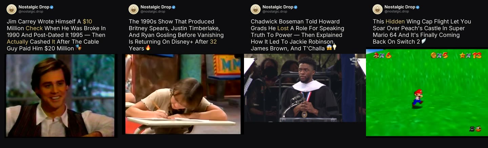

# Media Pipeline

**An autonomous, agent-operated short-form video pipeline: from news signal to published Instagram Reel, with a closed performance feedback loop.**

Built on [Hermes Agent](https://github.com/NousResearch/hermes-agent) by
[Nous Research](https://nousresearch.com).



<sub>Frames from four reels the pipeline produced and published for
@nostalgic.drop. The header card and hook are rendered by the pipeline, and the
footage is a single ≤25s moment from the source video.</sub>

---

## The problem

Short-form content is a volume and timing game. An account has to be relevant
to today's news, publish every day, and learn from its own numbers faster than
a person can. For a small operator, doing this by hand means hours a day of
monitoring news, digging through footage, editing, writing copy, posting, and
checking analytics, and those steps are exactly where the quality slips.

## The approach

Media Pipeline splits the work along one line:

- **Deterministic work is done by code.** Fetching news, searching video,
  cutting clips, rendering, publishing, and pulling metrics are plain Python
  scripts that do the same thing every time and can be audited.
- **Judgment is done by agents.** Deciding which story is worth telling, which
  moment of footage is strongest, how to write the hook, and whether a frame
  is clean are handled by Hermes agents running on a schedule. They follow a
  written operating playbook (the skill) and are only allowed to *call* the
  scripts, never reimplement them.

Two controls keep this safe to leave unattended: a **hard QC gate** that stops
a reel unless the agent left per-frame evidence that it inspected the footage,
and a **feedback loop** that turns each post's engagement into advisory
signals for the next day's topic selection.

## The reference deployment

The pipeline was built and run for **@nostalgic.drop**, an Instagram account
that ties current news to things a Gen Z / millennial audience grew up with:
a game remake, a show reboot, a discontinued product that's coming back.

Over its first eight weeks (August–September 2026) it ran on its own:

| | |
|---|---|
| Reels produced and published | **106** |
| Total reach | **26,177** accounts |
| Total views | **32,322** |
| Best single reel | 2,011 reach · 2,521 views · 71 likes · 9 saves |

It also changed its own editorial rules along the way. The analytics stage
showed that generic "famous person gives inspirational advice" posts reliably
stalled at ~120 reach. Hooks with a named subject, a setback, a reversal, and
a concrete payoff (a person, a number, a countable thing) consistently did
better. That structure is now written into the producer's rules.

## How it works

```
 11:00  1. Collect   collect_news.py pulls Google News, Reddit and RSS.
                     The agent keeps only stories with a real nostalgia angle → news.json
 11:20  2. Scout     yt_search.py ranks footage by views/day; the agent picks the
                     strongest ≤25s moment and checks the thumbnail → moments_*.json
 12:00  3. Produce   cut_clip.py downloads only that moment → make_reel.py renders
                     the branded reel → agent inspects frames every ~3s → qc_gate.py
                     blocks anything without a complete, passing audit trail
 4×/day 4. Publish   publish_reel.py posts the oldest queued reel via the Meta Graph API
 21:00  5. Learn     fetch_insights.py scores each post → performance_lessons.json,
                     which Stage 1 reads the next morning
```

| Stage | Hermes cron job | Scripts |
|---|---|---|
| 1. Collect | `reel-1-news-collector`, `wisdom-1-collector` | `collect_news.py` |
| 2. Scout | `reel-2-video-scout` | `yt_search.py`, `fetch_transcript.py` |
| 3. Produce | `reel-3-producer` | `cut_clip.py`, `make_reel.py`, `qc_frames.py`, `qc_gate.py` |
| 4. Publish | `reel-4-auto-publish`, `reel-4b-share-sampler` | `publish_reel.py`, `sample_shares.py` |
| 5. Learn | `reel-5-analytics` | `fetch_insights.py` |
| Upkeep | `ig-token-refresh` | `refresh_token.py` |

A local dashboard (`scripts/dashboard.py`, localhost only) shows the funnel,
the QC evidence for every reel, and the queue, and lets you pause, trigger, or
skip stages.

**See one reel traced end to end** through every stage's actual output in
[docs/example-run.md](docs/example-run.md).

## Design principles

- **Separation of fetch and judgment.** Scripts never make editorial calls and
  agents never touch media directly, so every decision leaves a readable file.
- **Evidence over claims.** An agent saying "QC passed" isn't enough.
  `qc_gate.py` requires a timestamped description of each frame it looked at.
- **Honest zeros.** A day with no strong story publishes nothing rather than
  padding the feed.
- **Minimal footprint on source material.** Only the chosen moment is
  downloaded, capped at 25 seconds, never a whole video.
- **Learning is advisory.** Performance signals shift the agents' preferences;
  they never hard-block a topic.

---

## Getting started

### Prerequisites

- macOS or Linux, Python 3.10+, and [`ffmpeg`](https://ffmpeg.org)
- [Hermes Agent](https://github.com/NousResearch/hermes-agent) with a model
  provider configured
- An Instagram **Business or Creator** account connected to a Meta app, with a
  long-lived access token that has the `instagram_content_publish` scope
- Optional: [Ollama](https://ollama.com) with `gemma3:4b` for the local
  frame-QC helper (`qc_frames.py`)

### 1. Install

```bash
git clone https://github.com/eddylam2024/media-pipeline.git ~/media-pipeline
cd ~/media-pipeline
pip install -r requirements.txt
```

Clone to `~/media-pipeline`. The agent playbook and cron prompts use that path.

### 2. Configure

```bash
cp ig_config.example.json ig_config.json
```

Fill in `ig_user_id` and `access_token`. `app_id` and `app_secret` are only
needed for automatic token refresh. `ig_config.json` is gitignored. Any value
can come from an environment variable instead: `IG_USER_ID`, `IG_TOKEN`,
`META_APP_ID`, `META_APP_SECRET`, or `IG_CONFIG` for the file path.

To make the pipeline your own:
- Edit `sources.json` to change which news queries, subreddits, and RSS feeds
  the collector reads.
- Replace `assets/avatar.png` and `assets/avatar_256.png`, and change `name`
  and `handle` in `render_header_hook()` in `scripts/make_reel.py`, to brand
  the reels as your account.

### 3. Try the scripts by hand

Nothing here publishes anything:

```bash
python3 scripts/collect_news.py                       # writes runs/<today>/raw_news_1100.json
python3 scripts/yt_search.py "super mario 64 wing cap gameplay" -n 12 --details 5
mkdir -p queue/test_reel
python3 scripts/cut_clip.py <video_id> 42 60 queue/test_reel/clip_01.mp4
echo '{"hook": "This *Hidden* Level Was In Your Childhood Console", "clip": "clip_01.mp4"}' > queue/test_reel/reel.json
python3 scripts/make_reel.py queue/test_reel          # → queue/test_reel/reel.mp4
python3 scripts/publish_reel.py --config ig_config.json --dry-run
```

### 4. Connect Hermes

1. Create a Hermes profile named `media-pipeline`.
2. Copy `hermes/skills/media-pipeline/` into the profile's `skills/` directory.
   This is the agents' operating playbook: rules, formats, and known pitfalls.
3. Create the cron jobs in `hermes/cron/jobs.example.json` with `hermes cron`,
   keeping each job's schedule, prompt, and skill. `ig-token-refresh` runs
   `refresh_token.py` directly without an agent, so copy that script into the
   profile's `scripts/` directory.
4. Start the gateway so the jobs run on schedule:
   `hermes -p media-pipeline gateway install --start-now --start-on-login`.

**Start with Stage 4 paused** and review a few days of reels in `queue/` (or
in the dashboard) before you let the pipeline publish on its own.

### 5. Monitor

```bash
python3 scripts/dashboard.py        # http://127.0.0.1:8787
```

## Repository layout

```
scripts/                  pipeline scripts and the local dashboard
hermes/skills/            agent operating playbook (Hermes skill)
hermes/cron/              scheduled job definitions: prompts and timings
docs/                     example outputs and an end-to-end trace
sources.json              news queries, subreddits, RSS feeds
assets/, fonts/           branding used by the renderer
ig_config.example.json    credentials template
```

At runtime the pipeline creates `news.json`, `queue/`, `posted/`, `skipped/`,
`runs/`, and the performance files. All of them are gitignored.

## Responsible use

You're responsible for the footage you publish. The pipeline keeps clips
short and uses them in a transformed format, but it doesn't clear rights for
you. Follow YouTube's and Instagram's terms and the copyright rules where you
operate.

## Author

Designed and built by **Edouard Lam** ([@eddylam2024](https://github.com/eddylam2024)).
Agent runtime by [Nous Research](https://nousresearch.com)'s Hermes Agent.
Fonts (Inter, Anton, EB Garamond) are under the SIL Open Font License.
